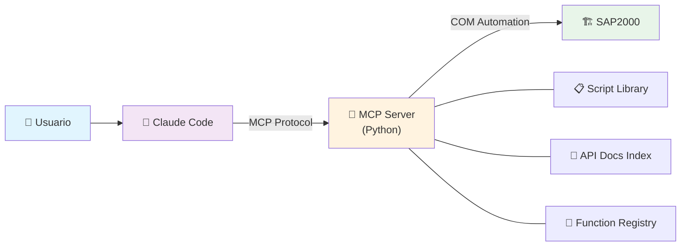

# SAP2000 Automation Framework

[](https://python.org)
[](https://www.csiamerica.com/products/sap2000)
[](LICENSE)
[](https://modelcontextprotocol.io)

**Framework de automatización de SAP2000 mediante Python, COM bridge y Model Context Protocol (MCP).**

Permite generar modelos estructurales, asignar cargas, ejecutar análisis y extraer resultados de forma programática — todo orquestado desde Claude Code como interfaz conversacional.

---

## Características Principales

- **MCP Bridge** — Servidor MCP que conecta Claude Code con SAP2000 vía COM automation
- **212 funciones API verificadas** — Registry con firmas, parámetros ByRef y wrappers testeados
- **127 wrapper scripts** — Funciones individuales documentadas y verificadas contra SAP2000 real
- **Scripts parametrizados** — Modelos completos generados programáticamente (vigas, domos, naves, placas base)
- **8 aplicaciones GUI standalone** — Interfaces PySide6 con worker threads para operación asíncrona
- **Sandbox seguro** — Ejecución aislada de scripts con restricciones de imports y timeout
- **Documentación API completa** — 25 archivos markdown cubriendo toda la API de SAP2000

---

## Arquitectura



### Flujo de Trabajo

1. El usuario describe lo que necesita en lenguaje natural a **Claude Code**
2. Claude Code consulta el **MCP Server** para buscar documentación y funciones verificadas
3. El MCP Server genera y ejecuta scripts en un **sandbox aislado**
4. SAP2000 procesa los comandos vía **COM automation** y retorna resultados
5. El script se guarda automáticamente en la **biblioteca de scripts**

### Componentes del MCP Server

| Módulo | Función |
|--------|---------|
| `server.py` | Entry point — registro de 12 herramientas MCP |
| `sap_bridge.py` | Conexión COM singleton a SAP2000 |
| `sap_executor.py` | Ejecutor con sandbox (imports restringidos, timeout) |
| `script_library.py` | Persistencia y búsqueda de scripts |
| `doc_search.py` | Motor de búsqueda sobre documentación API |
| `function_registry.py` | Base de datos de funciones verificadas |

---

## Requisitos

| Requisito | Versión |
|-----------|---------|
| **Windows** | 10/11 (SAP2000 solo corre en Windows) |
| **Python** | 3.10+ |
| **SAP2000** | Cualquier versión con soporte API |
| **comtypes** | Última versión |
| **mcp[cli]** | Última versión |
| **PySide6** | Para GUIs standalone (opcional) |

---

## Instalación

```bash
# 1. Clonar repositorio
git clone https://github.com/tu-usuario/Skills_SAP.git
cd Skills_SAP

# 2. Crear y activar entorno virtual
python -m venv .venv
.venv\Scripts\Activate.ps1

# 3. Instalar dependencias
pip install -r mcp_server/requirements.txt

# 4. (Opcional) Para GUIs standalone
pip install PySide6
```

### Configuración en Claude Code

Registrar el servidor MCP a **user scope**, para que esté disponible en cualquier
sesión y no solo dentro de este repositorio:

```powershell
claude mcp add sap2000 -s user -- <ruta-al-proyecto>\.venv\Scripts\python.exe <ruta-al-proyecto>\mcp_server\server.py
```

Queda guardado en `~/.claude.json` y se inicia automáticamente (stdio) al invocar
cualquier herramienta MCP. Verificar con `claude mcp list`.

> Las rutas deben ser absolutas: `${workspaceFolder}` no está disponible.
> Por eso `.mcp.json` y `.claude/settings.json` se dejan sin entrada `mcpServers`.

La skill [`sap2000-api`](.claude/skills/sap2000-api/SKILL.md) se carga
automáticamente al trabajar con scripts de SAP2000 y aporta la convención ByRef,
los templates y el workflow de scripting.

**Uso:**
1. Asegurarse de que SAP2000 esté abierto
2. Llamar `connect_sap2000` una vez por sesión para establecer el bridge COM
3. Las 12 herramientas MCP quedan disponibles automáticamente

---

## Ejemplos de Aplicación

Scripts completos en [`scripts/ejemplos/`](scripts/ejemplos/), generados conversacionalmente con Claude Code y verificados contra SAP2000 real.

| Script | Descripción |
|--------|-------------|
| [`example_1001_simple_beam.py`](scripts/ejemplos/example_1001_simple_beam.py) | Viga simplemente apoyada con verificación analítica (M, V, δ) |
| [`example_ring_areas_parametric.py`](scripts/ejemplos/example_ring_areas_parametric.py) | Anillo circular con 3 zonas concéntricas de espesor variable |
| [`domo_elipsoidal_parametrico_py.py`](scripts/ejemplos/domo_elipsoidal_parametrico_py.py) | Domo elipsoidal 3D — doble curvatura (quads + triángulos polares) |
| [`modelo_complejo_mixto.py`](scripts/ejemplos/modelo_complejo_mixto.py) | Nave industrial mixta HA+acero con análisis sísmico NCh2745 |
| [`mega_modelo_multi_torre.py`](scripts/ejemplos/mega_modelo_multi_torre.py) | Modelo multi-torre a gran escala |
| [`complex_geometry_showcase.py`](scripts/ejemplos/complex_geometry_showcase.py) | Showcase de geometría compleja parametrizada |
| [`test_bolt_plates_inline_py.py`](scripts/ejemplos/test_bolt_plates_inline_py.py) | Placa base con pernos de anclaje y balasto Winkler |

---

## Aplicaciones GUI Standalone

Interfaces gráficas completas construidas con PySide6, operables sin Claude Code ni VS Code. Cada GUI se conecta directamente a SAP2000 via COM.

### Modelo Base Estandarizado

**Archivos:** [`scripts/modelo_base/`](scripts/modelo_base/)

Generador de modelo base con materiales, patrones de carga, secciones de acero/HA, espectros NCh2369 y combinaciones LRFD/ASD/NCh. Configuración completa en archivo `config.py` con parámetros sísmicos por zona.

<!-- TODO: Agregar screenshot de GUI modelo_base -->

### Placa Base Paramétrica

**Archivos:** [`scripts/placabase/`](scripts/placabase/)

Interfaz para generar placas base con control visual de todos los parámetros: pernos, silla de anclaje, balasto, y mallado. Incluye worker threads para ejecución asíncrona sin bloquear la GUI.

<!-- TODO: Agregar screenshot de GUI placabase -->

### Anillo Circular

**Archivos:** [`scripts/ring_areas/`](scripts/ring_areas/)

GUI para generar anillos circulares parametrizados con control de radios, espesores y calidad de malla por zona concéntrica.

<!-- TODO: Agregar screenshot de GUI ring_areas -->

### Explorador de Database Tables

**Archivos:** [`scripts/database_tables/`](scripts/database_tables/)

Navegador y editor de las tablas internas de SAP2000. Permite listar todas las tablas, leer datos, editar celdas y exportar a CSV/XML/Excel. Cubre las 37 funciones de `DatabaseTables.*`.

<!-- TODO: Agregar screenshot de GUI database_tables -->

### Post-Proceso: Estabilidad y Shells

**Archivos:** [`scripts/post_proceso/`](scripts/post_proceso/)

Extracción de resultados de análisis: desplazamientos de nodos (`JointDispl`) para verificación de estabilidad y fuerzas en shells (`AreaForceShell`) para todas las combinaciones de carga. Opera sobre la selección manual del usuario en SAP2000.

<!-- TODO: Agregar screenshot de GUI post_proceso -->

### Combinaciones de Carga

**Archivos:** [`scripts/comb_cargas/`](scripts/comb_cargas/)

Gestor de combinaciones de carga con CRUD completo y templates de combinaciones normativas (LRFD, ASD, NCh). Permite crear, editar y eliminar combinaciones directamente en el modelo activo.

### Estados de Carga

**Archivos:** [`scripts/estados_carga/`](scripts/estados_carga/)

Aplicación multi-tab para mapeo y verificación de estados de carga. Arquitectura completa con capa de modelo dedicada, verificación basada en fixtures y funciones de cálculo reutilizables.

### Fundaciones

**Archivos:** [`scripts/fundaciones/`](scripts/fundaciones/)

Generador paramétrico de fundaciones. Diseño automatizado con conexión directa a SAP2000 para crear geometría, asignar propiedades y aplicar cargas.

---

## Registry de Funciones Verificadas

El framework mantiene un registro de **212 funciones API** verificadas contra SAP2000 real. Cada entrada incluye:

- **Firma completa** con tipos de parámetros
- **Layout ByRef** — posición de cada parámetro de salida en el tuple retornado
- **Wrapper script** — código ejecutable que demuestra el uso
- **Notas** — particularidades, valores por defecto, errores comunes

Categorías cubiertas:

| Categoría | Funciones | Ejemplo |
|-----------|-----------|---------|
| **File** | 2 | `NewBlank`, `Save`, `OpenFile` |
| **PropMaterial** | 10 | `SetMaterial`, `SetMPIsotropic`, `SetWeightAndMass` |
| **PropFrame** | 13 | `SetRectangle`, `SetCircle`, `SetISection`, `SetTube` |
| **PropArea** | 3 | `SetShell_1`, `GetNameList` |
| **Object_Model** | 22 | `AddCartesian`, `Count`, `GetCoordCartesian` |
| **FrameObj** | 2 | `AddByPoint`, `AddByCoord` |
| **AreaObj** | 1 | `AddByCoord` |
| **Properties** | 3 | `SetSection`, `SetTCLimits`, `SetSpring` |
| **Load_Patterns** | 4 | `Add`, `GetNameList`, `SetSelfWTMultiplier` |
| **Load_Cases** | 5 | `ResponseSpectrum.SetCase/SetLoads/GetLoads` |
| **RespCombo** | 10 | `Add`, `SetCaseList`, `GetCaseList`, `GetNameList` |
| **Analyze** | 3 | `RunAnalysis`, `GetActiveDOF`, `SetActiveDOF` |
| **Analysis_Results** | 5 | `JointDispl`, `JointReact`, `FrameForce`, `AreaForceShell` |
| **Database_Tables** | 37 | Lectura, escritura, edición, exportación |
| **Select** | 1 | `CoordinateRange` |
| **Constraints** | 3 | `SetBody`, `GetBody`, `SetDiaphragm` |
| **Design** | 9 | `StartDesign`, `GetCode`, `SetCode`, `SetComboStrength` |
| **Groups** | 2 | `AddGroup`, `SetGroupAssign` |
| **Edit** | 1 | `Divide` |
| **Functions** | 1 | `FuncRS.SetUser` |
| **Mass_Source** | 4 | `SetDefault`, `SetMassSource` |

---

## Estructura del Proyecto

```
Skills_SAP/
├── mcp_server/              # Servidor MCP (Python)
│   ├── server.py            #   Entry point — 12 herramientas MCP
│   ├── sap_bridge.py        #   Conexión COM singleton
│   ├── sap_executor.py      #   Sandbox de ejecución
│   ├── script_library.py    #   Persistencia de scripts
│   ├── doc_search.py        #   Buscador de documentación API
│   ├── function_registry.py #   Registry de funciones verificadas
│   └── tests/               #   Tests unitarios e integración
│
├── scripts/                 # Scripts y aplicaciones
│   ├── ejemplos/            #   7 scripts de ejemplo completos
│   ├── wrappers/            #   127 wrappers de funciones individuales
│   ├── templates/           #   Templates base (backend + GUI)
│   ├── mesh/                #   Backends de generación de malla
│   ├── modelo_base/         #   GUI: Modelo base estandarizado
│   ├── placabase/           #   GUI: Placa base paramétrica
│   ├── ring_areas/          #   GUI: Anillo circular
│   ├── database_tables/     #   GUI: Explorador de tablas
│   ├── post_proceso/        #   GUI: Estabilidad + shells
│   ├── comb_cargas/         #   GUI: Combinaciones de carga
│   ├── estados_carga/       #   GUI: Estados de carga
│   ├── fundaciones/         #   GUI: Fundaciones paramétricas
│   ├── columnas/            #   Generador de columnas
│   ├── steel_connections/   #   Conexiones de acero
│   ├── section_cut/         #   Section Cuts (en desarrollo)
│   └── registry.json        #   Registry de 212 funciones verificadas
│
├── API/                     # Documentación API SAP2000 (25 archivos .md)
│
└── .claude/
    ├── settings.json            # Settings de proyecto (Claude Code)
    └── skills/
        └── sap2000-api/         # Skill: referencia API + workflow de scripting
            ├── SKILL.md
            └── references/      # Enums, patrones, templates, guía GUI
```

---

## Herramientas MCP Disponibles

El servidor expone 12 herramientas invocables desde Claude Code:

| Herramienta | Descripción |
|-------------|-------------|
| `connect_sap2000` | Conectar/adjuntar a instancia de SAP2000 |
| `disconnect_sap2000` | Desconectar del modelo activo |
| `get_model_info` | Obtener info del modelo (unidades, conteos, archivo) |
| `execute_sap_function` | Ejecutar una función API individual |
| `run_sap_script` | Ejecutar un script completo en sandbox |
| `list_scripts` | Listar scripts guardados |
| `load_script` | Cargar código fuente de un script |
| `search_api_docs` | Buscar en documentación API |
| `list_api_categories` | Listar categorías de documentación |
| `query_function_registry` | Consultar funciones verificadas |
| `register_verified_function` | Registrar nueva función verificada |
| `list_registry_categories` | Listar categorías del registry |

---

## Tecnologías

- **Python 3.10+** — Lenguaje principal
- **comtypes** — Interfaz COM para SAP2000
- **MCP (Model Context Protocol)** — Protocolo de comunicación con Claude Code
- **FastMCP** — SDK para servidor MCP
- **PySide6** — Framework GUI (aplicaciones standalone)
- **SAP2000 API** — API COM de CSI para análisis estructural

---

## Licencia

Este proyecto está bajo la licencia MIT. Ver [LICENSE](LICENSE) para más detalles.

---

## AiConnect integration (adapter)

This fork adds an AiConnect adapter without modifying upstream tool logic:

- `mcp_server/aioconnect.py` — license gate (`ensure_licensed()` at startup + per-call recheck via `MCP_LICENSE_TOKEN`) and a central envelope wrap of all 12 registered tools (`{"success": true, "data": ...}` / `fail("LICENSE"|"TOOL_ERROR", ...)`). Enabled only when `AICONNECT_ENABLE=1`; otherwise the server runs as plain upstream.
- `run_server.py` — entrypoint for the gateway bridge (`--cmd python3 run_server.py`); keeps `python -m mcp_server.server` working unchanged.
- `manifest.json` — AiConnect manifest: `stdio: true`, `entitlement_tier: pro`, token via `MCP_LICENSE_TOKEN`, platform requirements (`windows` + `com`).
- COM is imported lazily (`sap_bridge.py`) so the server starts headless on any platform — `tools/list`, `query_function_registry`, `run_sap_script` sandbox, `doc_search` all work; only `connect_sap2000` needs real SAP2000 + COM and returns a structured `TOOL_ERROR` envelope off-Windows.

Upstream: https://github.com/fcocarrascob/Skills_SAP (commit `a882a15`), MIT license preserved verbatim (`LICENSE`).
